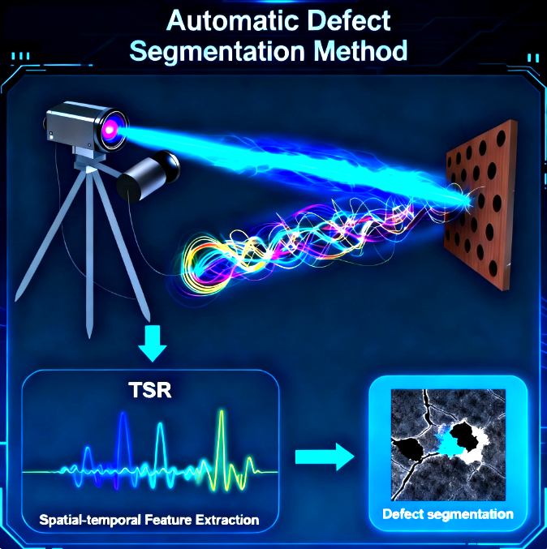

  
<H1>Transformer-based Defect Segmentation.</H1> 
introduction:This paper proposes a defect segmentation framework based on TSR derivative spatio-temporal signals and the Transformer model. The framework effectively combines the advantages of TSR derivative signals with the self-attention mechanism of the Transformer, thereby significantly enhancing the model’s capability for defect detection and edge segmentation. The framework first performs first-order derivative TSR processing to suppress noise and enhance defect contrast in infrared thermal image sequence. Next, the optimal sampling location and image sequence length are determined based on the sampling strategy. Subsequently, spatio-temporal samples for each pixel are extracted using a feature extraction method. Finally, a Transformer-based defect segmentation model effectively learns representative defect features from these spatio-temporal samples. The binary segmentation images generated by the model accurately identify defect shapes and regions. 
 
P.S.Points for attention: 
&emsp;1.Please store your thermography data as .mat format (Matlab). 
&emsp;2.Please follow the procedure outlined in the introduction and use the provided codes in sequence. 
&emsp;3.Please use the IOU.py file to evaluate the model segmentation results. An IOU value exceeding 0.8 indicates satisfactory performance. 
For detailed usage instructions, please refer to the paper:Automated defect detection using spatial and temporal deep learning in thermographic nondestructive evaluation. 
The dataset has been uploaded to the following URL: https://pan.baidu.com/s/1D5RWAcduCyBrfdmUaRT3BA?pwd=0796.

